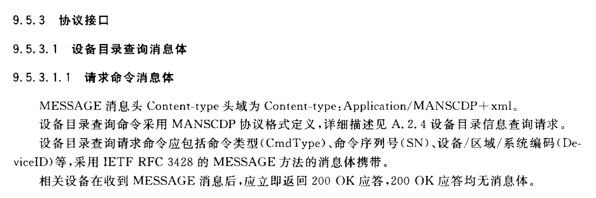
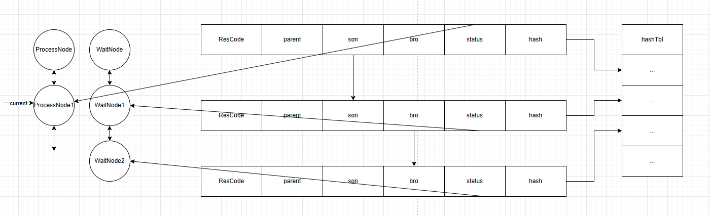
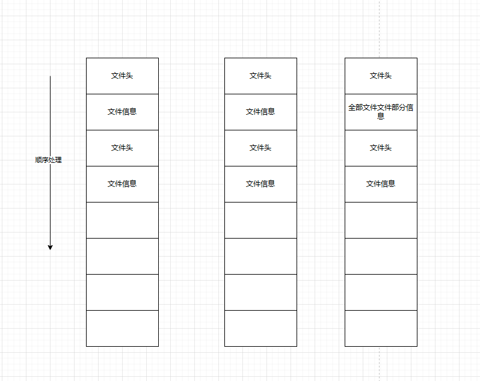

[TOC]

## 项目经验

### 资源推送性能优化
安防平台的设备资源树存在父子关系，国标要求资源推送过程中先推送父资源再推送子资源。优化过程中结合二叉树、链表和哈希表设计并实现了全新的安防平台资源推送方法，既能使用多线程推送，又能保证推送顺序。优化完成后资源推送性能提升数十倍，在对接行业内其他平台时性能优势明显。推送方法已申请专利。

**详细介绍:**
安防平台中除了管理实际存在的设备（相机）之外，还有一些虚拟概念，相机的“父组织”，虚拟设备“告警资源”，他们会按父子结构生成为一颗资源树。简单的上下级平台两棵资源树示例如下所示。

国标协议中要求安防平台实现目录查询功能。目录查询用通俗的语言解释就是下级平台，将资源树按约定的格式上报给上级平台，使上级平台能建立出同样的资源树，以便于上级平台可以查询下级平台的设备状态和设备的实况视频和录像等。

为了上级平台可以正确挂载资源树上的节点，目录查询要求下级平台上报资源树上的某个资源之前，要先上报资源的父资源。这就要求推送资源有序，所以各个厂商一般采用单线程推送。
随着全国安防平台逐渐联网，上级平台的资源树越来越深，组织和相机越来越多，一次资源查询可能会查询十数个小时才能完成，如果中途因为网络不稳定等原因有一个资源失败，则需要再次查询（协议中需要携带资源总数字段，上级平台要校验总数），浪费了大量的时间和网络资源。需要对资源推送性能进行优化。

第一次优化：
单线程完成所有“父组织”的推送，再多线程完成所有相机的推送，再多线程完成“子设备”的推送。但是大多数场景下，组织资源也很多，性能仍然不满足需求。

第二次优化：
结合业务特点，设计特殊数据结构，在多线程推送的同时，保证推送顺序。数据结构如下图所示：

1.当目录查询开始前，根据实际的资源树结构在内存中构建二叉树。所有节点的状态指向wait。
2.根节点加入处理链。多线程从处理链上取节点，从树形结构和哈希中查询其他信息，组装报文发送给上级平台
3.节点响应成功时，将成功的节点从处理链上删除，并将其子节点和子节点的所有兄弟节点加入处理链
4.继续多线程读取处理链表，重复上述步骤

**项目成果:**
优化完成后性能提升数十倍（100条/s----> 3000条/s），对接行业内其他厂家平台时，资源推送性能优势明显。在国家数据中心的评比中，资源推送性能远超行业内其他厂家。此资源推送方法已申请专利，专利号 CN112988407A

### SNMP协议
SNMP协议中有很多种数据类型，解析和组装报文时按常规思维实现，会有大量的条件判断语句。参考数个已有的开源实现，均为每种类型单独一个条件分支，函数规模较大，维护和扩展成本较高。
实现时运用简单工厂和模板方法模式，用多态替换条件表达式，由父类委托具体的子类进行编解码，有效减少了条件分支和冗余代码。并依据最小知识原则，将数据流和数据分为两个类，数据和数据流类为组合关系，仅数据类对外暴露，有效减少了外部依赖。

**为避免信息安全问题，此处仅贴出简化过的类图，和实际实现并不一致，仅供参考**

**项目成果:**
按时完成了高质量交付，代码整体获得了较高的白盒评价。个人编码的部分被评为部门优秀代码。
个人完成了SNMP模块测试框架的搭建，引入开源软件对接自研协议栈，使得自验证期间可以发现大部分问题，有效减少后端问题。

### 解包工具重构
**详细介绍:**
文件解包模块需要处理数种结构的包，旧的逻辑是每一种类型的包是一个分支，从文件头向后顺序处理。随着包类型的增多分支越来越多，难以维护。并且当文件较大时解包较慢，需要优化。

问题点分析：
1、分支过多，应该用多态替换条件表达式
2、性能瓶颈点，经gperftools分析后，瓶颈点是文件的解压，CPU密集型，应该想办法用多线程

优化方法：
1、使用工厂模式根据不同的包类型创建解包示例，用多态替换条件表达式
2、用模板方法将解包流程更改为  获取全部文件列表---解包----解压文件。不再和之前一样一个一个解析，而是先解出所有的文件信息，再解包，此时解包和解压可以使用多线程来提升性能。

**项目成果:**
优化完成后，代码规模由2K优化至0.4K，代码维护成本显著下降。解包大文件的性能由19s优化到2s。
获得了部门优秀代码。

### 路由选路实现重构
原有的选路实现为根据硬件的特点，由单独一个分支进行处理，随着硬件类型的增多，原有代码分支越来越多，难以收敛。
结合业务特点，对基站内选路业务进行了重新建模，将选路抽象为图上的路径搜索。并对建模的边进行了特殊处理，以解决交换芯片间连线的选择问题。
**为避免信息安全问题，此处仅贴出简化过的建模图，和实际实现并不一致，仅供参考**
- 直观的建模方式

- 优化后的建模方式

**项目成果:**
代码逻辑得到明显简化，代码维护成本显著下降。
新硬件类型加入进来时仅需要进行少量适配，大大减少了维护成本。